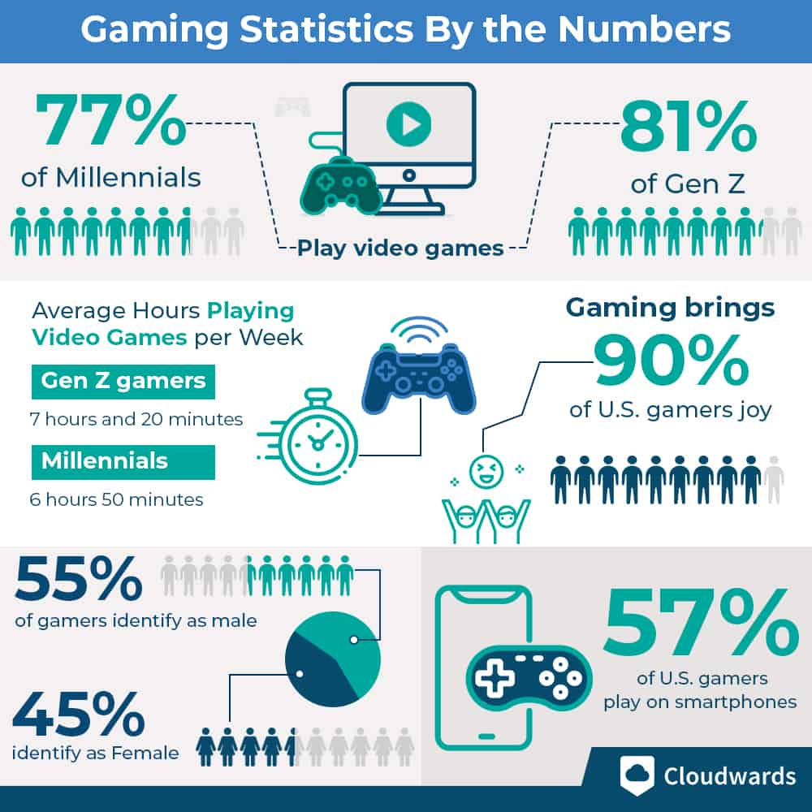

# Market Overview

Online gaming isn’t going anywhere; desktop and mobile gamers enjoy games more than ever. Keep reading for some fascinating online gaming statistics and trends that show us where the gaming industry is and where it might be headed in the near future.

<figure><figcaption>
Gaming Statistics by Cloudwards
</figcaption></figure>

## Interesting facts about online gaming

* More than **870,000** gamers are **online** as you are reading this.
* At the time of writing, **Steam game stats** indicate that there were between **16 and 29 million** players online in the past **48 hours**.
* With the gaming industry having a revenue of **$178.2 billion**, and online gaming being a big part of that, it’s safe to say that the online gaming industry is massive nowadays.

## How Does Gaming Affect Relationships and Friendships?

**78%** of gamers in the **U.S.** agree that online gaming plays a huge part in **making new friendships and relationships**. Whether you meet new people in the game or become better friends with people you hang out with daily, online gaming helps.

## How Does Playing Affect Online Gamers?

Gaming is not just about socializing — **90% of the gamers** in the U.S. claim that they **get joy out of gaming**, with **87%** saying that video games provide mental stimulation.

<figure><figcaption>
Graph depicting player experiences
</figcaption></figure>

## Average Age of Video Game Players

The average gamer is 31 years old. **The age group between 18 and 34 years old is also the most common age group for gamers**, including 38% of the entire age range breakdown, followed by 20% for players under 18. The least common age group is players older than 65, at only 7%.

<figure><figcaption>
Gamers by age range
</figcaption></figure>

## Preferred game genres according to gamers

<figure><figcaption>
Preferred game genres
</figcaption></figure>

## Subscription-based Gaming

Sony's Playstation Plus platform has been locked behind a paywall since 2013, but between 2014 and 2021 it has gained 39.7 million users despite the lack of a free option. Now, Sony’s **PlayStation Plus has around 47.6 million subscribers**.

## Social gaming trends

In 2020, **65% of all gamers claimed to play games with others**, either online or in person. In **2021, that number increased to 77%**, which is a strong indicator of the social aspect's importance.

## Metaverse trend statistics

* Travis Scott hosted a concert with **12.3M** live viewers in 2020.
* Last year, people spent **$501M** in metaverse real estate.
* Snoop Dogg’s “Snoopverse” brought in **$14M** of revenue on its **first day**.
* **38%** of people would only try **extreme sports** in the metaverse.
* Meta (Facebook) invested over $10B into its metaverse division last year.

## Closing thoughts on Market Overview

When all is said and done, the online video gaming industry isn’t going anywhere. New video games are constantly coming out, mobile gaming is on an unprecedented rise, and we have more multiplayer games to choose from than ever. These online gaming industry statistics should help paint a better picture of where the market is now and where it could go in the future.
