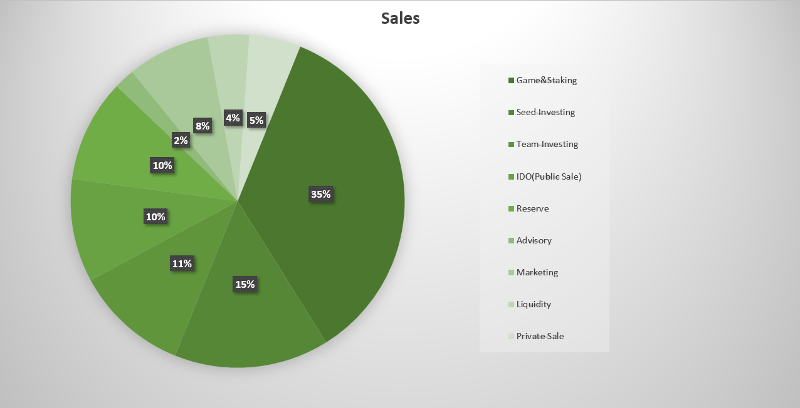

# Token Sale

**$SLNT** will have a total supply of **1 billion** tokens that be categorized as follows:

* Ecosystem Growth 40%
* Treasury 22.5%
* Sale 20%
* Core distribution 17.5%

Each category of tokens will follow a vesting schedule as given below:

| Category          | Schedule                                   |
| ----------------- | ------------------------------------------ |
| Ecosystem         | 1% TGE, then 1% linear monthly             |
| Treasury          | 20% TGE, then 1/48th linear monthly        |
| Sale              | 18-month cliff, then 1/24th linear monthly |
| Core Contribution | 24-month cliff, then 1/24th linear monthly |

<figure><figcaption>
Sales Pie Chart
</figcaption></figure>
